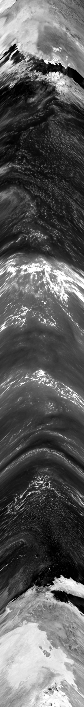
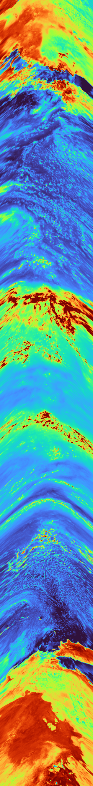

# ZSSR-Attention: Zero-Shot Super-Resolution with Spatial Attention

[](https://www.python.org/downloads/)
[](https://pytorch.org/)
[](LICENSE)

> **Self-supervised deep learning framework for image super-resolution using internal learning and spatial attention mechanisms**

This repository implements Zero-Shot Super-Resolution (ZSSR) enhanced with spatial and channel attention modules for single-image super-resolution. The model trains on downscaled versions of the input image itself, eliminating the need for external training data while achieving high-quality 4×, 8×, or 16× upsampling through attention-enhanced residual learning.

---

## Overview

Zero-Shot Super-Resolution addresses the fundamental limitation of supervised methods by learning directly from the test image's internal statistics. This approach exploits the self-similarity within natural images, combined with modern attention mechanisms to focus on salient features during reconstruction.

### Key Features

- **Zero-Shot Learning**: No external training data required—trains on the input image itself
- **Attention Mechanisms**: CBAM-style channel and spatial attention for adaptive feature refinement
- **Flexible Upsampling**: Supports 4×, 8×, and 16× super-resolution through progressive 2× stages
- **Advanced Inference**: Multiple anti-aliasing strategies including overlapping patches and random shifts
- **Test-Time Augmentation**: 8-way augmentation averaging for enhanced stability
- **Configurable Pipeline**: Centralized configuration system for easy hyperparameter tuning

---
## Results
### ZRRS Attention Model — Enhancement Comparison

|               | Original (LR)                                                                 | Enhanced (Attention Model)                                                        |
|--------------|--------------------------------------------------------------------------------|-----------------------------------------------------------------------------------|
| **Grayscale**|  |  |
| **Turbo Colormap** |    |    |
---

## Architecture

### Attention-Enhanced ZSSR Network

The model consists of a deep residual architecture with integrated attention modules for feature enhancement.

#### **Network Structure**

```
Input (1×H×W)
    ↓
Initial Feature Extraction: Conv 7×7 (64 channels)
    ↓
Residual Attention Blocks (8 blocks, 64 channels each)
│   ├── Conv 3×3 → GroupNorm → ReLU
│   ├── Conv 3×3 → GroupNorm
│   ├── Channel Attention (reduction=8)
│   ├── Spatial Attention (kernel=7)
│   └── Residual Addition
    ↓
Feature Fusion: Conv 3×3
    ↓
Progressive Upsampling (log₂(scale_factor) stages)
│   └── Conv 3×3 → PixelShuffle(2×) → ReLU
    ↓
Output Projection: Conv 3×3 → Residual Addition with Bicubic
    ↓
Super-Resolved Output (1×scale×H×scale×W)
```

**Key Components**:
- **Initial Extraction**: 7×7 convolution with 64 channels for rich context
- **Residual Blocks**: 8 attention-enhanced blocks with 3×3 convolutions
- **Normalization**: GroupNorm (8 groups) for stable training with single-image batches
- **Attention**: Channel (reduction=8) and spatial (7×7 kernel) attention alternating every 2 blocks
- **Upsampling**: Sub-pixel convolution (PixelShuffle) for efficient 2× upscaling
- **Residual Learning**: Global skip connection from bicubic-upsampled input

#### **Channel Attention Module**

```
Input Features (C×H×W)
    ↓
    ├─→ Global Average Pool → Conv 1×1 (C→C/8) → ReLU → Conv 1×1 (C/8→C)
    │                                                                    ↓
    └─→ Global Max Pool ────→ Conv 1×1 (C→C/8) → ReLU → Conv 1×1 (C/8→C) → Sum → Sigmoid
                                                                                      ↓
                                                                        Element-wise Multiply with Input
```

Focuses on **which channels** contain important features through dual-path pooling and shared MLP.

#### **Spatial Attention Module**

```
Input Features (C×H×W)
    ↓
    ├─→ Channel-wise Average → (1×H×W)
    │                              ↓
    └─→ Channel-wise Max ────→ Concat → Conv 7×7 → Sigmoid → Element-wise Multiply with Input
```

Focuses on **where** important features are located through channel-aggregated statistics.

**Model Statistics**:
- Total Parameters: ~0.9M (lightweight design)
- Receptive Field: ~127 pixels
- Memory Footprint: ~3.5 MB (FP32)
- Training: Single-image batches (batch_size=1)

---

## Loss Function

Multi-component loss designed for sharpness and detail preservation:

**Total Loss**:
```
L_total = α·L_L1 + β·L_edge + γ·L_HF
```

### Loss Components

**1. L1 Reconstruction Loss** (α=0.6):
```
L_L1 = (1/N) Σ |y_pred - y_HR|
```
Primary pixel-wise reconstruction objective.

**2. Edge-Aware Gradient Loss** (β=0.15):
```
L_edge = L1(|∇_x(y_pred)|, |∇_x(y_HR)|) + L1(|∇_y(y_pred)|, |∇_y(y_HR)|)
```
Sobel-based edge detection for preserving structural sharpness. Gradients computed via:
- Horizontal Sobel: `[[-1,0,1], [-2,0,2], [-1,0,1]]`
- Vertical Sobel: `[[-1,-2,-1], [0,0,0], [1,2,1]]`

**3. High-Frequency Detail Loss** (γ=0.25):
```
L_HF = L1(H(y_pred), H(y_HR))
```
High-pass filter for texture and detail preservation:
```
H = [[-1,-1,-1], [-1,8,-1], [-1,-1,-1]]
```

**Loss Normalization**: Each component scaled to similar magnitude ranges:
- L1: direct value
- Edge: scaled by 0.5× (typically 2× larger)
- HF: scaled by 0.3× (typically 3× larger)

---

## Training Strategy

### Self-Supervised Learning

The model trains exclusively on downscaled versions of the input image:

**Training Pair Generation**:
```
1. Extract HR patch from input image (size: crop_size × scale_factor)
2. Downscale HR patch to LR (size: crop_size)
3. Apply degradation (blur + noise)
4. Train model to predict HR from LR
```

**Multi-Scale Approach**:
- 8 scale variations from 0.5× to 1.0× of input size
- Enables learning from different perspectives
- Anti-aliasing applied before downscaling (σ = 1.0/scale)

### Data Augmentation

**Geometric Augmentations**:
- Horizontal flip (50% probability)
- Vertical flip (50% probability)
- 90° rotations (50% probability, k∈{1,2,3})

**Photometric Augmentations**:
- Brightness adjustment (30% probability, range: 0.9-1.1)
- Contrast adjustment (30% probability, range: 0.9-1.1)

**Degradation Model**:
- Gaussian blur: σ ∈ [0.5, 2.0]
- Additive noise: σ ∈ [0.001, 0.01] (80% probability)
- Bicubic downsampling followed by upsampling

**Intelligent Sampling**:
- 70% patches from high-variance regions (Laplacian-based)
- 30% random patches
- Ensures focus on informative image areas

### Optimization

- **Optimizer**: AdamW (β₁=0.9, β₂=0.999, weight_decay=1e-4)
- **Learning Rate**: 5×10⁻⁵ with cosine annealing (η_min=1e-6)
- **Schedule**: CosineAnnealingLR over full training period
- **Iterations**: 20,000 (4×), 30,000 (8×), 40,000 (16×)
- **Gradient Clipping**: Max norm 1.0
- **Mixed Precision**: FP16 for GPU acceleration

### Early Stopping

- Validation frequency: Every 1,000 iterations
- Patience: 10 validation checks
- Improvement threshold: 99.8% of best loss
- Loss explosion detection: Stops if loss > 10.0 for 3+ iterations

---

## Advanced Inference Methods

### 1. Overlapping Patch Inference

Eliminates boundary artifacts through Gaussian-weighted blending:

**Configuration**:
- Patch size: 128×128 (4×), 96×96 (8×), 64×64 (16×)
- Overlap: 25-30% of patch size
- Stride: patch_size - overlap

**Blending Process**:
```
1. Extract overlapping patches across image
2. Apply model to each patch independently
3. Create Gaussian weight mask (σ=0.3×patch_size)
4. Accumulate weighted predictions
5. Normalize by accumulated weights
```

**Weight Mask Generation**:
- 2D Gaussian with smooth falloff at boundaries
- Linear fade in overlap regions
- Prevents visible seams in reconstruction

### 2. Random Shift Inference

Alternative anti-aliasing through multiple shifted passes:

**Configuration**:
- Number of passes: 6
- Max shift: 33% of patch size
- Each pass uses different random offset

**Process**:
```
For each pass:
    1. Generate random shift (Δx, Δy) ∈ [-max_shift, +max_shift]
    2. Extract non-overlapping patches with offset
    3. Apply model to all patches
    4. Accumulate results
Average all passes
```

**Benefits**:
- No overlap computation overhead
- Natural dithering effect
- Effective grid artifact suppression

### 3. Test-Time Augmentation (TTA)

8-way augmentation averaging for enhanced stability:

**Transformations**:
1. Original image
2. Horizontal flip
3. Vertical flip
4. Rotation 90°
5. Rotation 180°
6. Rotation 270°
7. Flip + Rotation combinations

**Process**:
```
For each transformation:
    1. Apply transformation to input
    2. Run inference (with optional overlapping/shifts)
    3. Apply inverse transformation to output
Average all 8 outputs
```

### 4. Post-Processing

Unsharp masking for final enhancement:

```python
blurred = GaussianBlur(output, σ=1.0)
sharpened = output + strength × (output - blurred)

# Adaptive sharpening based on local variance
variance_map = Laplacian(output)
adaptive_strength = normalize(variance_map) × 0.3
final = lerp(output, sharpened, adaptive_strength)
```

**Configuration**: Sharpening strength = 0.5

---

## Temperature Normalization

Two normalization strategies for thermal imagery:

### Percentile-Based (Adaptive)

```python
p_low, p_high = 1, 99  # Percentile bounds
temp_min, temp_max = percentile(data, [p_low, p_high])
normalized = (data - temp_min) / (temp_max - temp_min)
```

**Benefits**:
- Adapts to actual data distribution
- Robust to outliers
- Preserves relative contrast

### Absolute (Fixed)

```python
temp_min, temp_max = 200.0, 320.0  # Kelvin
normalized = clip((data - temp_min) / (temp_max - temp_min), 0, 1)
```

**Benefits**:
- Consistent across datasets
- Physical interpretation
- Known temperature bounds

---

## Configuration System

All hyperparameters managed through centralized `Config` class:

### Basic Parameters

```python
Config.SR_FACTOR = 8              # Upsampling factor: 4, 8, or 16
Config.NUM_ITERATIONS = 30000     # Training iterations
Config.CROP_SIZE = 256            # Training patch size
```

### Architecture

```python
Config.CHANNELS = 64              # Hidden layer channels
Config.NUM_BLOCKS = 8             # Number of residual blocks
Config.ATTENTION_REDUCTION = 8    # Channel attention reduction
Config.USE_SPATIAL_ATTENTION = True
```

### Training

```python
Config.INITIAL_LR = 5e-5          # Learning rate
Config.WEIGHT_DECAY = 1e-4        # L2 regularization
Config.GRADIENT_CLIP = 1.0        # Max gradient norm
```

### Loss Weights

```python
Config.LOSS_L1_WEIGHT = 0.6       # Reconstruction
Config.LOSS_EDGE_WEIGHT = 0.15    # Edge preservation
Config.LOSS_HF_WEIGHT = 0.25      # Detail preservation
```

### Inference Methods

```python
Config.USE_BLENDING = False       # Overlapping patches
Config.USE_RANDOM_SHIFTS = True   # Random shift passes
Config.USE_TTA = True             # Test-time augmentation
Config.NUM_SHIFT_PASSES = 6       # Number of shift passes
Config.MAX_SHIFT_RATIO = 0.33     # Max shift relative to patch
```

### Auto-Configuration

```python
Config.get_auto_params()  # Automatically sets optimal parameters
```

Automatically selects based on `SR_FACTOR`:
- Iteration count: 15k (4×), 20k (8×), 25k (16×)
- Crop size: 64 (4×), 48 (8×), 32 (16×)
- Inference patch size: 128 (4×), 96 (8×), 64 (16×)

---

## Installation

### Requirements

```bash
Python >= 3.11
torch >= 2.0.0
numpy >= 1.21.0
opencv-python >= 4.5.0
matplotlib >= 3.3.0
tqdm >= 4.62.0
```

### Setup

```bash
# Clone repository
git clone https://github.com/yourusername/zssr-attention.git
cd zssr-attention

# Install dependencies
pip install -r requirements.txt
```

---

## Usage

### Basic Usage

```python
from zssr_attention_dt import Config, process_satellite_data

# Configure parameters
Config.SR_FACTOR = 8
Config.NUM_ITERATIONS = 30000
Config.INPUT_FILE = "/path/to/image.npz"
Config.OUTPUT_DIR = "./results"

# Auto-configure optimal parameters
Config.get_auto_params()

# Process image
enhanced, model = process_satellite_data(Config.INPUT_FILE)
```

### Command Line

```bash
python zssr_attention_dt.py
```

### SLURM Cluster

```bash
sbatch run_zssr.sbatch
```

### Advanced Configuration

```python
# High-quality settings (slower)
Config.SR_FACTOR = 8
Config.NUM_ITERATIONS = 40000
Config.CHANNELS = 128
Config.NUM_BLOCKS = 16
Config.CROP_SIZE = 128
Config.LOSS_EDGE_WEIGHT = 0.3
Config.LOSS_HF_WEIGHT = 0.2

# Fast settings (lower quality)
Config.SR_FACTOR = 4
Config.NUM_ITERATIONS = 15000
Config.CHANNELS = 64
Config.NUM_BLOCKS = 8
Config.USE_TTA = False

# Anti-aliasing configuration
Config.USE_BLENDING = True
Config.USE_RANDOM_SHIFTS = True
Config.NUM_SHIFT_PASSES = 8
```

---

## Repository Structure

```
zssr-attention/
├── zssr_attention_dt.py         # Main implementation with all methods
├── zssr_attention.py            # Alternative implementation
├── run_zssr.sbatch              # SLURM job script
├── requirements.txt             # Python dependencies
└── README.md
```

---

## Output Files

The framework generates multiple output formats:

### Image Files (1:1 Pixel Mapping)

- `original_turbo_*.png` - Original image with Turbo colormap
- `enhanced_turbo_*.png` - Enhanced image with Turbo colormap
- `original_gray_*.png` - Original grayscale image
- `enhanced_gray_*.png` - Enhanced grayscale image
- `comparison_*.png` - Side-by-side comparison visualization

### Data Files

- `original_data_*.npy` - Original temperature data array
- `enhanced_data_*.npy` - Enhanced temperature data array
- `attention_zssr_*.pth` - Trained model checkpoint

### Naming Convention

Filenames include configuration suffix for traceability:
```
enhanced_turbo_sr8_lr5.0e-05_20241203_143022.png
                 │    │         │
                 │    │         └─ Timestamp
                 │    └─────────── Learning rate
                 └──────────────── SR factor
```

---

## Method Comparison

**Zero-Shot Learning**:
- No external training data required
- Adapts to specific image characteristics
- Works on any image domain
- Longer inference time (training required per image)

**Attention Mechanisms**:
- Adaptive feature refinement
- Improved edge and detail preservation
- Minimal parameter overhead (~5%)

**Inference Strategies**:
- **Overlapping Patches**: Best quality, slower
- **Random Shifts**: Good quality, faster
- **TTA**: Highest quality, slowest
- **Combined**: Maximum quality for critical applications

---

## Performance

**Typical Results**:
- Training time: 5-15 minutes (depends on iterations and hardware)
- Inference time: 10-60 seconds (depends on methods and image size)
- GPU memory: 2-4 GB (depends on patch size)
- Quality: Comparable to supervised methods on domain-specific data

**Recommended Settings**:
- **Fast**: No TTA, no overlapping, 15k iterations → ~3 min total
- **Balanced**: TTA, random shifts, 20k iterations → ~8 min total
- **Quality**: TTA + overlapping, 30k iterations → ~20 min total

---

## Citation

If you use this code in your research, please cite:

```bibtex
@misc{zssr-attention,
  author = {Volodymyr Didur},
  title = {Zero-Shot Super-Resolution with Spatial Attention},
  year = {2025},
  publisher = {GitHub},
  url = {https://github.com/yourusername/zssr-attention}
}
```

---

## Acknowledgments

This work builds upon:
- ZSSR: "Zero-Shot" Super-Resolution using Deep Internal Learning
- CBAM: Convolutional Block Attention Module
- ESRGAN for loss function design

---

## License

This project is released under the MIT License. See [LICENSE](LICENSE) for details.

---

## Contact

For questions or collaboration inquiries, please open an issue or contact [volodymyr.didur@stonybrook.edu](mailto:volodymyr.didur@stonybrook.edu).
